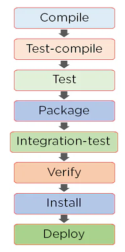

# Construcción de proyectos con Maven

## Instalación necesaria

- IntelliJ Idea
- Maven

## Build Tools

Imagina que eres un carpintero, necesitas de distintas herramientas que te ayudarán a realizar tus tareas de manera más fácil, rápida y eficiente, al mismo tiempo que puedes organizar tu trabajo de mejor manera. Esto aplicado al mundo de software se conoce como “Build Tools”.

Los Build Tools (o también conocidos como Herramientas de Construcción) son aplicaciones de software que ayudan en la automatización de construcción, es decir, ayudan en el proceso de automatizar una variedad de tareas que son requeridas por los desarrolladores de software, por ejemplo:

Compilar código fuente
Generar paquetes en código binario
Manejar bibliotecas necesarias para la ejecución de una aplicación
Ejecutar pruebas automatizadas
Desplegar una aplicación
Dentro de las Herramientas de Construcción más conocidas tenemos:

- Apache Ant (Java)
- Apache Maven (Java)
- Gradle (Java)
- Grunt (JavaScript)
- Gulp (JavaScript)

## Maven

Maven es una herramienta de creación de gestión de proyectos de software basada en Project Object Model (POM). La herramienta se utiliza normalmente para proyectos basados ​​en Java . Cada proyecto de Java requiere ciertas dependencias, que se descargan automáticamente cuando se ejecuta una compilación de Maven. Esto simplifica las tareas diarias de los desarrolladores de Java y les ayuda con sus proyectos.

Maven ayuda a recuperar los archivos JAR correctos para cada proyecto, ya que puede haber diferentes versiones de paquetes separados. Si desea descargar dependencias, ya no necesita visitar el sitio web oficial de cada software. Se puede hacer rápidamente ahora visitando "mvnrepository.com".

Maven es una popular herramienta de compilación de código abierto que Apache Group desarrolló para compilar, publicar e implementar varios proyectos. Maven está escrito en Java y se utiliza para crear proyectos escritos en C#, Scala, Ruby, etc. La herramienta se utiliza para construir y administrar cualquier proyecto basado en Java. Simplifica el trabajo diario de los desarrolladores de Java y les ayuda con diversas tareas.

## POM

Maven se basa en Project Object Model (POM) y se centra en la simplificación y estandarización del proceso de construcción.

Durante el proceso, Maven se encarga de los siguientes elementos:

- Construye
- Dependencias
- Informes
- Distribución
- Lanzamientos
- Lista de correo

___

- Project Object Model (POM) se refiere a los archivos XML con toda la información sobre el proyecto y los detalles de configuración
- Contiene la descripción del proyecto, así como detalles sobre el control de versiones y la gestión de la configuración del proyecto.
- El archivo XML está en el directorio de inicio del proyecto. Maven busca el POM en el directorio actual cuando se necesita ejecutar cualquier tarea determinada

## Repositorios en Maven

Los repositorios de Maven se refieren a los directorios de archivos JAR empaquetados que contienen metadatos. Los metadatos se refieren a los archivos POM relevantes para cada proyecto. Estos metadatos son los que permiten a Maven descargar dependencias.
Hay tres tipos de repositorios:

1. Repositorio local:

El repositorio local se refiere a la máquina del desarrollador, que es donde se guarda todo el material del proyecto. Este repositorio contiene todos los archivos jar de dependencia.

2. Repositorio remoto:

El repositorio remoto se refiere al repositorio presente en un servidor web, que se usa cuando Maven necesita descargar dependencias. Este repositorio funciona igual que el repositorio central. Siempre que se requiere algo del repositorio remoto, primero se descarga al repositorio local y luego se usa.

3. Repositorio central:

El repositorio central se refiere a la comunidad de Maven que entra en acción cuando se necesitan dependencias, y esas dependencias no se pueden encontrar en el repositorio local. Maven descarga las dependencias desde aquí cuando sea necesario.

## Características de Maven

Dependencias y repositorios

- Las dependencias se refieren a las bibliotecas de Java necesarias para el proyecto. Los repositorios hacen referencia a los directorios de archivos JAR empaquetados.
- Si las dependencias no están presentes en su repositorio local, Maven las descarga desde un repositorio central y las almacena en el repositorio local.

Construir ciclos de vida, fases y objetivos

- Esto consiste en una secuencia de fases de construcción, y cada fase de construcción consta de una serie de objetivos
- Cada meta es responsable de una tarea en particular.
- Cuando se ejecuta un proceso, también se compilan todos los propósitos relacionados con esa fase y sus complementos.

Crear perfiles

- Esto se refiere al conjunto de valores de configuración requeridos para construir un proyecto usando diferentes configuraciones.
- Se agregan diferentes perfiles de compilación a los archivos POM al habilitar diferentes compilaciones.
- Un perfil de compilación ayuda a personalizar la compilación para diferentes entornos.

Complementos de compilación

- Un complemento de Maven se refiere al grupo de objetivos que pueden o no estar en la misma fase.
- Los complementos se utilizan para realizar un objetivo específico.
- Maven tiene sus complementos estándar que se pueden usar. Si lo desea, los usuarios también pueden implementar el suyo propio en Java.

Ciclo de vida de construcción de Maven

El ciclo de vida de construcción de Maven es una secuencia de pasos que deben seguirse para construir un proyecto, lo que finalmente ayuda a ejecutar los objetivos.

Las siguientes son las fases del ciclo de vida de la construcción:

Apache Maven gestiona todos los procesos, como la creación, la documentación, la publicación y la distribución en la gestión de proyectos.

- La herramienta simplifica la forma de construcción del proyecto al aumentar el rendimiento del proyecto y el proceso de construcción.
- La tarea de descargar dependencias y archivos JAR está automatizada
- Maven proporciona fácil acceso a toda la información necesaria
- Maven simplifica al desarrollador la construcción de un proyecto en diferentes entornos sin preocuparse por las dependencias, los procesos, etc.
- En Maven, es simple agregar nuevas dependencias: solo tiene que escribir el código de dependencia en el archivo POM