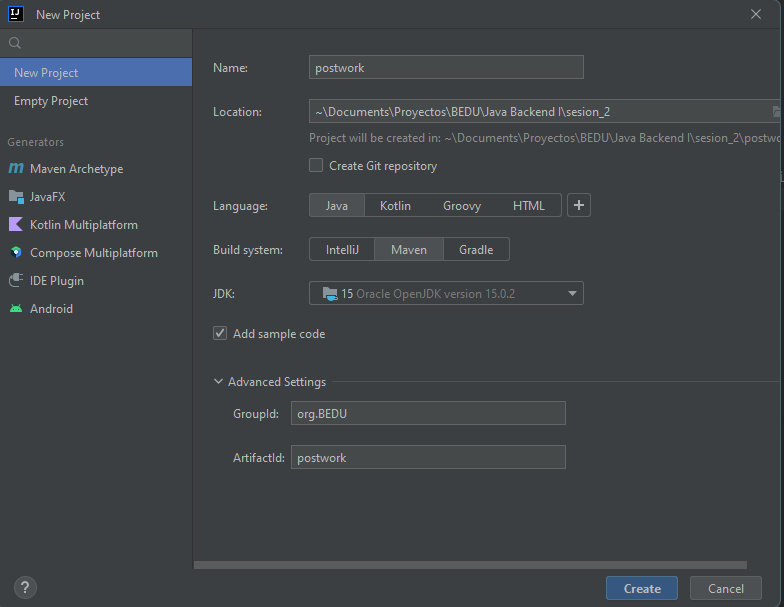
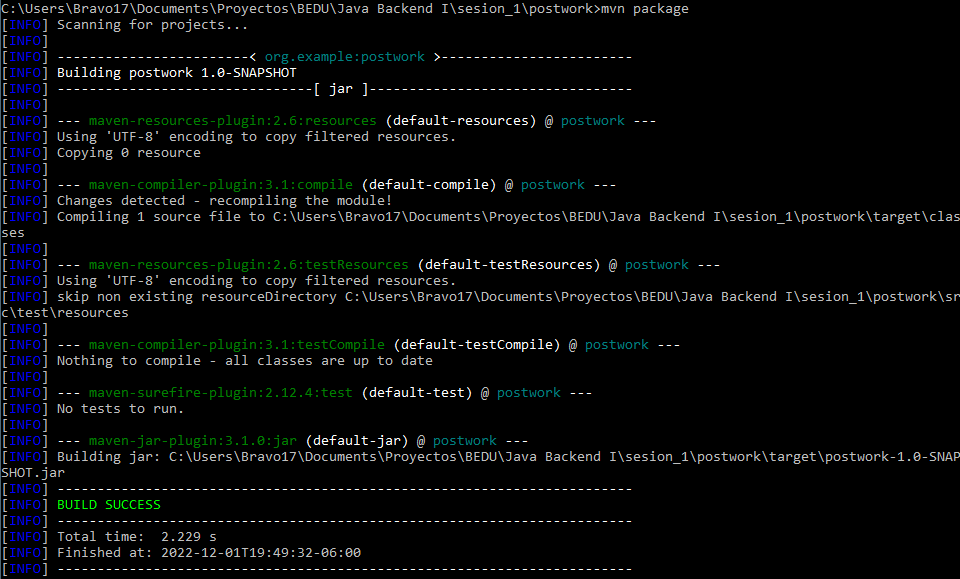
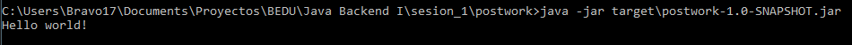

# Construcción de Proyectos con Maven :mortar_board:

## Desarrollo

En esta sesión aprendimos qué es Maven y cómo podemos utilizarlo para automatizar procesos como compilación y ejecución de proyectos. Una parte fundamental son las dependencias que nos ayudarán a extender el potencial de nuestros proyectos.

## Checklist

:white_check_mark: A. Archivo de configuración pom.xml		

:white_check_mark: B. Inclusión de un repositorio de git en el proyecto	

:white_check_mark: C. Ejecución correcta de la dependencia gdx

## Indicaciones generales

El objetivo de este postwork agregar un repositorio en git a tu proyecto a partir de Maven con la dependencia [gdx](https://libgdx.com/wiki/articles/maven-integration).

___

## **Solución**

Creamos un nuevo proyecto, en este utilizamos IntelliJ IDEA.

- Ingresamos el nombre del proyecto.
- Configuramos la ruta donde se almacenará.
- Seleccionamos **`Java`** como lenguaje.
- Seleccionamos **`Maven`** como sistema de construcción del proyecto.



Una vez creado el proyecto tendremos una estructura de directorios similar a la siguiente:

```
C:.
│   pom.xml
│
├───.idea
│       .gitignore
│       compiler.xml
│       encodings.xml
│       jarRepositories.xml
│       misc.xml
│       vcs.xml
│       workspace.xml
│
└───src
    ├───main
    │   ├───java
    │   │   └───org
    │   │       └───example
    │   │               Main.java
    │   │
    │   └───resources
    └───test
        └───java
```

Abrimos el archivo **`pom.xml`**, tendrá la siguiente estructura.

```xml
<?xml version="1.0" encoding="UTF-8"?>
<project xmlns="http://maven.apache.org/POM/4.0.0"
         xmlns:xsi="http://www.w3.org/2001/XMLSchema-instance"
         xsi:schemaLocation="http://maven.apache.org/POM/4.0.0 http://maven.apache.org/xsd/maven-4.0.0.xsd">
    <modelVersion>4.0.0</modelVersion>

    <groupId>org.example</groupId>
    <artifactId>postwork</artifactId>
    <version>1.0-SNAPSHOT</version>

    <properties>
        <maven.compiler.source>15</maven.compiler.source>
        <maven.compiler.target>15</maven.compiler.target>
        <project.build.sourceEncoding>UTF-8</project.build.sourceEncoding>
    </properties>

</project>
```

Agregamos el siguiente **`plugin`** al **`pom.xml`**.

```xml
<build>
    <plugins>
        <plugin>
            <groupId>org.apache.maven.plugins</groupId>
            <artifactId>maven-jar-plugin</artifactId>
            <version>3.1.0</version>
            <configuration>
                <archive>
                    <manifest>
                        <mainClass>org.example.Main</mainClass>
                    </manifest>
                </archive>
            </configuration>
        </plugin>
    </plugins>
</build>
```

Y a continuación agregamos el **`repositorio`** de [gdx](https://libgdx.com/wiki/articles/maven-integration)

```xml
<repositories>
    <repository>
      <id>gdx-nightlies</id>
      <url>https://oss.sonatype.org/content/repositories/snapshots/</url>
    </repository>
</repositories>
```

El archivo **`pom.xml`** queda de la siguiente manera.

```xml
<?xml version="1.0" encoding="UTF-8"?>
<project xmlns="http://maven.apache.org/POM/4.0.0"
         xmlns:xsi="http://www.w3.org/2001/XMLSchema-instance"
         xsi:schemaLocation="http://maven.apache.org/POM/4.0.0 http://maven.apache.org/xsd/maven-4.0.0.xsd">
    <modelVersion>4.0.0</modelVersion>

    <groupId>org.example</groupId>
    <artifactId>postwork</artifactId>
    <version>1.0-SNAPSHOT</version>

    <properties>
        <maven.compiler.source>15</maven.compiler.source>
        <maven.compiler.target>15</maven.compiler.target>
        <project.build.sourceEncoding>UTF-8</project.build.sourceEncoding>
    </properties>

    <build>
        <plugins>
            <plugin>
                <groupId>org.apache.maven.plugins</groupId>
                <artifactId>maven-jar-plugin</artifactId>
                <version>3.1.0</version>
                <configuration>
                    <archive>
                        <manifest>
                            <mainClass>org.example.Main</mainClass>
                        </manifest>
                    </archive>
                </configuration>
            </plugin>
        </plugins>
    </build>

    <repositories>
        <repository>
            <id>gdx-nightlies</id>
            <url>https://oss.sonatype.org/content/repositories/snapshots/</url>
        </repository>
    </repositories>

</project>
```
___

## Proyecto terminado

Ya tenemos el proyecto listo, ahora vamos a ejecutarlo.

Ejecutamos el comando **`mvn package`** para construir el paquete que contendrá el archivo  con extensión **`.jar`**



Si observamos el arbol de directorios y archivos, notaremos que nos generó una carpeta llamada **`target`**.

```
C:.
│   pom.xml
│
├───.idea
│       .gitignore
│       compiler.xml
│       encodings.xml
│       jarRepositories.xml
│       misc.xml
│       vcs.xml
│       workspace.xml
│
├───src
│   ├───main
│   │   ├───java
│   │   │   └───org
│   │   │       └───example
│   │   │               Main.java
│   │   │
│   │   └───resources
│   └───test
│       └───java
└───target
    │   postwork-1.0-SNAPSHOT.jar
    │
    ├───classes
    │   └───org
    │       └───example
    │               Main.class
    │
    ├───generated-sources
    │   └───annotations
    ├───maven-archiver
    │       pom.properties
    │
    └───maven-status
        └───maven-compiler-plugin
            ├───compile
            │   └───default-compile
            │           createdFiles.lst
            │           inputFiles.lst
            │
            └───testCompile
                └───default-testCompile
                        inputFiles.lst
```
## Ejecución

Dentro de la carpeta **`target`** vamos a encontrar el archivo **`postwork-1.0-SNAPSHOT.jar`**, ahora vamos a ejecutarlo desde la terminal con el comando **`java - jar target\postwork-1.0-SNAPSHOT.jar`**



Nos devuelve un sencillo **`Hello world!`**.

Por último subimos los cambios a nuestro repositorio en github utilizando los siguientes comandos.

```
git add .

git commit -m "Creación del proyecto del postwork de la sesión 1 de Java Backend en BEDU"

git push origin main
```

**Nota**: No olvidar agregar al archivo **`.gitignore`** la carpeta target y demás extenciones que no son necesarias.