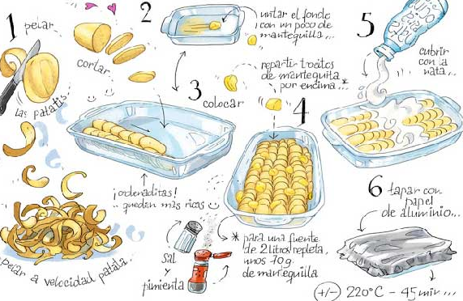

# Patrones de diseño

Los patrones de diseño son soluciones habituales a problemas que ocurren con frecuencia en el diseño de software. Son como planos prefabricados que se pueden personalizar para resolver un problema de diseño recurrente en tu código.

No se puede elegir un patrón y copiarlo en el programa como si se tratara de funciones o bibliotecas ya preparadas. El patrón no es una porción específica de código, sino un concepto general para resolver un problema particular. Puedes seguir los detalles del patrón e implementar una solución que encaje con las realidades de tu propio programa.

## ¿En qué consiste un Patrón de Diseño?

A menudo los patrones se confunden con algoritmos porque ambos conceptos describen soluciones típicas a problemas conocidos. Mientras que un algoritmo siempre define un grupo claro de acciones para lograr un objetivo, un patrón es una descripción de más alto nivel de una solución. El código del mismo patrón aplicado a dos programas distintos puede ser diferente.

Una analogía de un algoritmo sería una receta de cocina: ambos cuentan con pasos claros para alcanzar una meta. Por su parte, un patrón es más similar a un plano, ya que puedes observar cómo son su resultado y sus funciones, pero el orden exacto de la implementación depende de ti.

La mayoría de los patrones se describen con mucha formalidad para que la gente pueda reproducirlos en muchos contextos. Aquí tienes las secciones que suelen estar presentes en la descripción de un patrón:

- El propósito del patrón explica brevemente el problema y la solución.
- La motivación explica en más detalle el problema y la solución que brinda el patrón.
- La estructura de las clases muestra cada una de las partes del patrón y el modo en que se relacionan.
- El ejemplo de código en uno de los lenguajes de programación más populares facilita la asimilación de la idea que se esconde tras el patrón.

## Historia de los Patrones de Diseño

Quién inventó los patrones de diseño? Esa es una buena, aunque imprecisa pregunta. Los patrones de diseño no son conceptos opacos y sofisticados, al contrario. Los patrones son soluciones habituales a problemas comunes en el diseño orientado a objetos. Cuando una solución se repite una y otra vez en varios proyectos, al final alguien le pone un nombre y explica la solución en detalle. Básicamente, así es como se descubre un patrón.

El concepto de los patrones fue descrito por Christopher Alexander en El lenguaje de patrones. El libro habla de un “lenguaje” para diseñar el entorno urbano. Las unidades de este lenguaje son los patrones. Pueden describir lo altas que tienen que ser las ventanas, cuántos niveles debe tener un edificio, cuán grandes deben ser las zonas verdes de un barrio, etcétera.

La idea fue recogida por cuatro autores: Erich Gamma, John Vlissides, Ralph Johnson y Richard Helm. En 1995, publicaron Patrones de diseño, en el que aplicaron el concepto de los patrones de diseño a la programación. El libro presentaba 23 patrones que resolvían varios problemas del diseño orientado a objetos y se convirtió en un éxito de ventas con rapidez. Al tener un título tan largo en inglés, la gente empezó a llamarlo “el libro de la ‘gang of four’ (banda de los cuatro)”, lo que pronto se abrevió a “el libro GoF”.

Desde entonces se han descubierto decenas de nuevos patrones orientados a objetos. La “metodología del patrón” se hizo muy popular en otros campos de la programación, por lo que hoy en día existen muchos otros patrones no relacionados con el diseño orientado a objetos.

La realidad es que podrías trabajar durante años como programador sin conocer un solo patrón. Mucha gente lo hace. Incluso en ese caso, podrías estar implementando patrones sin saberlo. Así que, ¿por qué dedicar tiempo a aprenderlos?

- Son un juego de herramientas de soluciones comprobadas a problemas habituales en el diseño de software. Incluso aunque nunca te encuentres con estos problemas, conocer los patrones sigue siendo de utilidad, porque te enseña a resolver todo tipo de problemas utilizando principios del diseño orientado a objetos.

- Definen un lenguaje común que puedes utilizar con tus compañeros de equipo para comunicaros de forma más eficiente. Podrías decir: “Oh, utiliza un singleton para eso”, y todos entenderían la idea de tu sugerencia. No habría necesidad de explicar qué es un singleton si conocen el patrón y su nombre.

## Categorías de Patrones de Diseño

Los patrones de diseño varían en su complejidad, nivel de detalle y escala de aplicabilidad al sistema completo que se diseña. Piensa en la analogía de la construcción de carreteras: puedes hacer más segura una intersección instalando semáforos o construyendo un intercambiador completo de varios niveles con pasajes subterráneos para peatones.

Los patrones más básicos y de más bajo nivel suelen llamarse idioms. Normalmente se aplican a un único lenguaje de programación.

Los patrones más universales y de más alto nivel son los patrones de arquitectura. Los desarrolladores pueden implementar estos patrones prácticamente en cualquier lenguaje. Al contrario que otros patrones, pueden utilizarse para diseñar la arquitectura de una aplicación completa.

Además, todos los patrones pueden clasificarse por su propósito. Este libro cubre tres grupos generales de patrones:

- Los patrones creacionales proporcionan mecanismos de creación de objetos que incrementan la flexibilidad y la reutilización de código existente.
- Los patrones estructurales explican cómo ensamblar objetos y clases en estructuras más grandes a la vez que se mantiene la flexibilidad y eficiencia de la estructura.
- Los patrones de comportamiento se encargan de una comunicación efectiva y la asignación de responsabilidades entre objetos.

