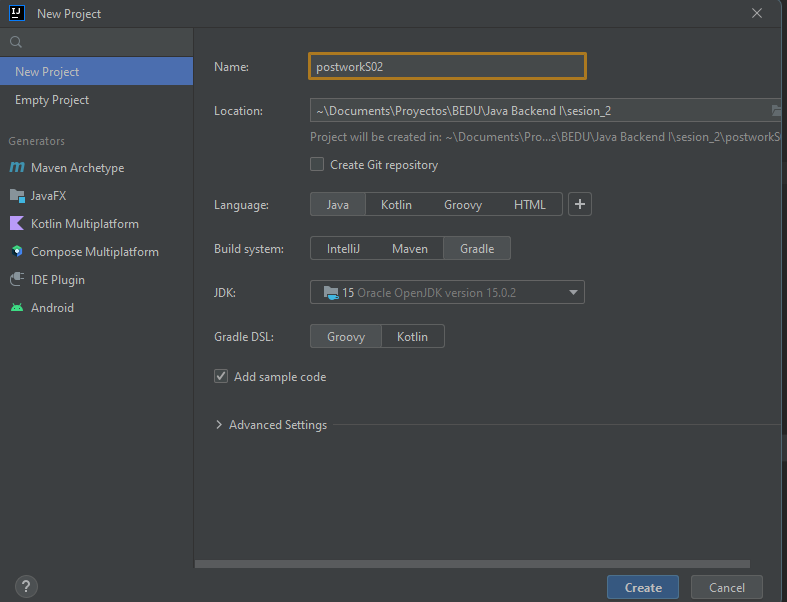
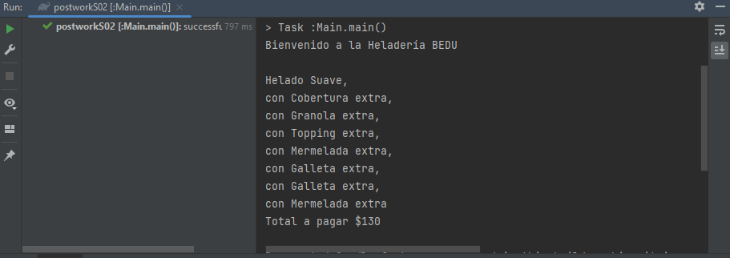

# Patrones de diseño :mortar_board:

## Objetivo
- Resolver un problema utilizando patrones de diseño
- Construir la solución utilizando Gradle

## Checklist

:white_check_mark: A. Archivo de configuración gradle.build para compilar y ejecutar el programa


:white_check_mark: B. Clases que reflejan la implementación con el patrón Decorador	


:white_check_mark: C. Programa que permite probar las clases creadas

## Desarrollo

En esta sesión aprendimos la importancia de los patrones de diseño en el desarrollo y el cómo pueden facilitarnos la solución de diversos problemas a través de la Programación Orientada a Objetos.

## Indicaciones generales:

Una cadena de helados muy famosa en el país ha solicitado tu ayuda para implementar una nueva versión de su sistema actual.

Sus productos disponibles son los siguientes:

- Helado Suave $30
- Con Cobertura $20 extra
- Con Granola $10 extra
- Con Topping $20 extra

El sistema actualmente está diseñado con Programación Orientada a Objetos usando el lenguaje Java y tienen una clase por cada variante de los productos, como se muestra a continuación:

```java
class HeladoSuave{
    ...
}

class HeladoSuaveConCobertura{
    ...
}

class HeladoSuaveConGranola{
    ...
}

class HeladoSuaveConTopping{
    ...
}

class HeladoSuaveConCoberturaYTopping{
    ...
}

class HeladoSuaveConToppingYGranola{
    ...
}

class HeladoSuaveConCoberturaYGranola{
    ...
}
```

La cadena busca agregar nuevos extras::

- Con Mermelada $10 extra
- Con Galleta $15 extra

La inclusión de estos productos complica el desarrollo del sistema actual debido a que habría que agregar todas las variantes de los productos viejos con los nuevos. Por lo tanto el sistema no es mantenible.

Tú misión será crear la nueva versión del sistema utilizando el patrón Decorador de los patrones estructurales, así como un programa que permita probar la nueva implementación.

___

## **Solución**

Creamos un nuevo proyecto, en este utilizamos IntelliJ IDEA.

- Ingresamos el nombre del proyecto.
- Configuramos la ruta donde se almacenará.
- Seleccionamos **`Java`** como lenguaje.
- Seleccionamos **`Gradle`** como sistema de construcción del proyecto.



Una vez creado el proyecto tendremos una estructura de directorios similar a la siguiente:

```
C:.
 build.gradle
│   gradlew
│   gradlew.bat
│   settings.gradle
│
├───.gradle
│   │   file-system.probe
│   │
│   ├───7.4
│   │   │   gc.properties
│   │   │
│   │   ├───checksums
│   │   │       checksums.lock
│   │   │       md5-checksums.bin
│   │   │       sha1-checksums.bin
│   │   │
│   │   ├───dependencies-accessors
│   │   │       dependencies-accessors.lock
│   │   │       gc.properties
│   │   │
│   │   ├───executionHistory
│   │   │       executionHistory.bin
│   │   │       executionHistory.lock
│   │   │
│   │   ├───fileChanges
│   │   │       last-build.bin
│   │   │
│   │   ├───fileHashes
│   │   │       fileHashes.bin
│   │   │       fileHashes.lock
│   │   │       resourceHashesCache.bin
│   │   │
│   │   └───vcsMetadata
│   ├───buildOutputCleanup
│   │       buildOutputCleanup.lock
│   │       cache.properties
│   │       outputFiles.bin
│   │
│   └───vcs-1
│           gc.properties
│
├───.idea
│       .gitignore
│       compiler.xml
│       gradle.xml
│       jarRepositories.xml
│       misc.xml
│       vcs.xml
│       workspace.xml
│
├───bin
│   ├───main
│   │   └───org
│   │       └───BEDU
│   │               Main.class
│   │
│   └───test
├───gradle
│   └───wrapper
│           gradle-wrapper.jar
│           gradle-wrapper.properties
│
└───src
    ├───main
    │   ├───java
    │   │   └───org
    │   │       └───BEDU
    │   │               Main.java
    │   │
    │   └───resources
    └───test
        ├───java
        └───resources
```

Comenzamos a crear las clases e interfaces del proyecto.

Creamos una iterface `Helado`.

```java
public interface Helado {
    public String getDescripcion();
    public int getPrecio();
}
```

Ahora creamos la clase `HeladoSuave`, implementando la interfaz `Helado` y sobreescribimos `getDescripcion()` y `getPrecio()`

```java
public class HeladoSuave implements Helado{

    @Override
    public String getDescripcion() {
        return "Helado Suave";
    }

    @Override
    public int getPrecio() {
        return 30;
    }
}
```

Creamos las clases de cada extra para el helado siguiendo el siguiente proceso.

- Implementa la interfaz `Helado`.
- Creamos un objeto privado de tipo `Helado`.
- Creamos un constructor que recibe como parámetro un objeto de tipo `Helado`.
- Sobreescribimos `getDescripcion()` y `getPrecio()`

Clase **`CoberturaDecorador`**

```java
public class CoberturaDecorador implements Helado{
    private Helado helado;

    public CoberturaDecorador(Helado helado) {
        this.helado = helado;
    }

    @Override
    public String getDescripcion() {
        return helado.getDescripcion() + ", \ncon Cobertura extra";
    }

    @Override
    public int getPrecio() {
        return helado.getPrecio() + 20;
    }
}
```

Clase **`GalletaDecorador`**

```java
public class GalletaDecorador implements Helado{

    private Helado helado;

    public GalletaDecorador(Helado helado) {
        this.helado = helado;
    }

    @Override
    public String getDescripcion() {
        return helado.getDescripcion() + ", \ncon Galleta extra";
    }

    @Override
    public int getPrecio() {
        return helado.getPrecio() + 15;
    }
}
```

Clase **`GranolaDecorador`**

```java
public class GranolaDecorador implements Helado{

    private Helado helado;

    public GranolaDecorador(Helado helado) {
        this.helado = helado;
    }

    @Override
    public String getDescripcion() {
        return helado.getDescripcion() + ", \ncon Granola extra";
    }

    @Override
    public int getPrecio() {
        return helado.getPrecio() + 10;
    }
}
```

Clase **`MermeladaDecorador`**

```java
public class MermeladaDecorador implements Helado{
    private Helado helado;

    public MermeladaDecorador(Helado helado) {
        this.helado = helado;
    }

    @Override
    public String getDescripcion() {
        return helado.getDescripcion() + ", \ncon Mermelada extra";
    }

    @Override
    public int getPrecio() {
        return helado.getPrecio() + 10;
    }
}
```

Clase **`ToppingDecorador`**

```java
public class ToppingDecorador implements Helado{

    private Helado helado;

    public ToppingDecorador(Helado helado) {
        this.helado = helado;
    }

    @Override
    public String getDescripcion() {
        return helado.getDescripcion() + ", \ncon Topping extra";
    }

    @Override
    public int getPrecio() {
        return helado.getPrecio() + 20;
    }
}
```

Para último creamos nuestra clase `Main`, cramos un objeto `suave` de tipo `Helado` y ya podemos crear cualquier cantidad de extras para nuestro helado.

```java
public class Main {
    public static void main(String[] args) {

        Helado suave = new HeladoSuave();

        suave = new CoberturaDecorador(suave);
        suave = new GranolaDecorador(suave);
        suave = new ToppingDecorador(suave);
        suave = new MermeladaDecorador(suave);
        // Agregamos Doble Galleta
        suave = new GalletaDecorador(suave);
        suave = new GalletaDecorador(suave);
        // Agregamos una vez más Mermelada
        suave = new MermeladaDecorador(suave);

        System.out.println("Bienvenido a la Heladería BEDU\n");
        System.out.println(suave.getDescripcion());
        System.out.println("Total a pagar $" + suave.getPrecio());
    }
}
```

Antes de ejecutar configuramos nuestro archivo `build.gradle`.

```xml
plugins {
    id 'application'
}

group 'org.BEDU'
version '1.0-SNAPSHOT'

repositories {
    mavenCentral()
}

dependencies {
    testImplementation 'org.junit.jupiter:junit-jupiter-api:5.8.1'
    testRuntimeOnly 'org.junit.jupiter:junit-jupiter-engine:5.8.1'
}

application {
    mainClass = "Main"
}

test {
    useJUnitPlatform()
}
```

## Ejecutamos

