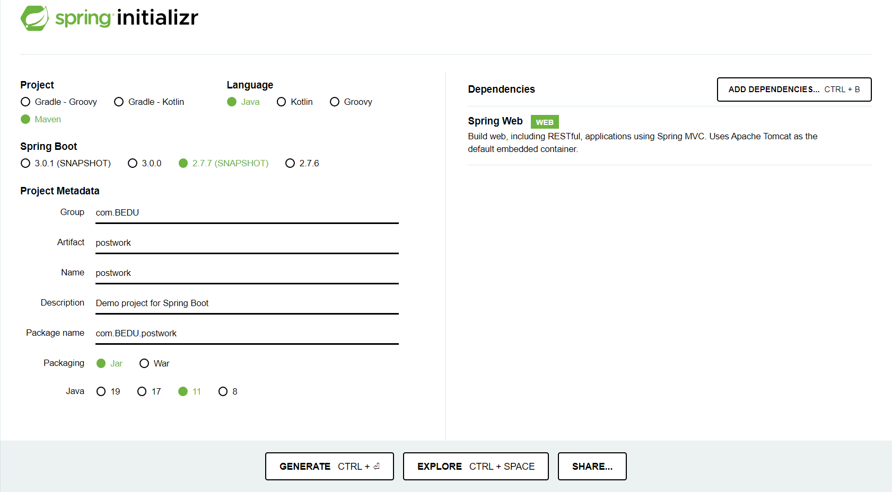
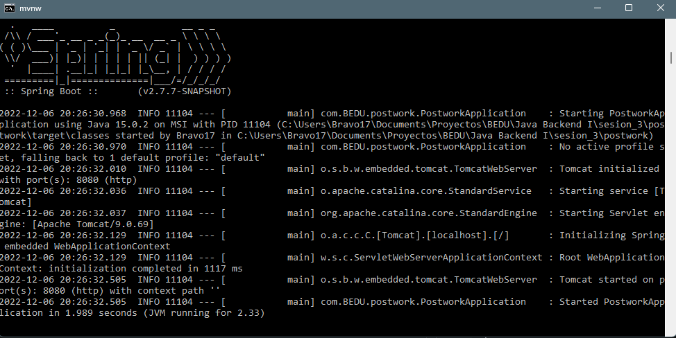
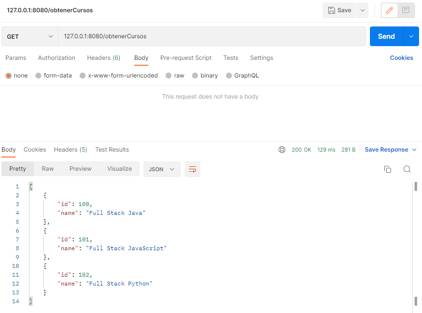
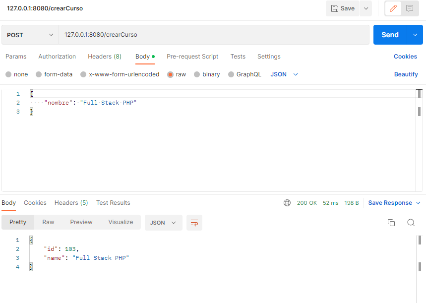
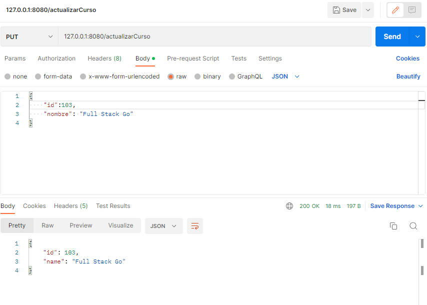
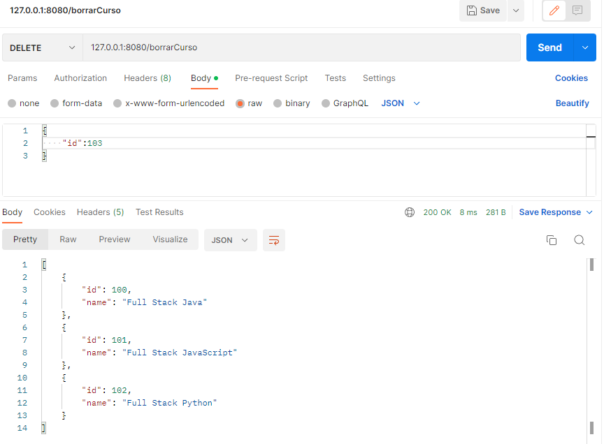

# Introducción a Spring Boot

## Desarrollo

En esta sesión aprendimos qué es Spring Framework y cómo Spring Boot facilita aún más el desarrollo de aplicaciones backend.

## Checklist

:white_check_mark: A. Archivo de configuración pom.xml para compilar y ejecutar el programa		

:white_check_mark: B. Uso del patrón MVC para la generación del proyecto

:white_check_mark: C. Presencia y correcto funcionamiento de todos los métodos definidos en los controladores del proyecto

## Asegúrate de comprender:

- Cómo utilizar el Spring Initializr para crear un proyecto
- Cómo configurar un proyecto de Maven
- Cómo crear un código base de Spring Boot

## Indicaciones generales

Para este postwork se generará el esqueleto inicial del proyecto que estaremos realizando a lo largo de estos dos módulos. Este proyecto es una API REST, por lo que los primeros pasos son definir la estructura inicial del proyecto. Es importante notar que los datos que se usan en el entregable de esta sesión son de prueba y sin persistencia ya que aún no contamos con una base de datos.

Deberás realizar las siguientes tareas:

- Generación del proyecto a partir de Spring initializr.
- Identificar las entidades presentes en tu proyecto (los actores de este, que eventualmente se convertirán en tablas en la base de datos)
- Creación de controladores siguiendo el patrón MVC para cada una de las entidades con los siguientes métodos:


    - Consulta de información
    - Guardado de información
    - Actualización de información
    - Eliminación de la información
___

## **Solución**

Creamos un nuevo proyecto desde el sitio oficial de Spring [Spring Initializr](https://start.spring.io/), para saber que versión seleccionar abrimos una terminal y verificamos la versión de Java que tenemos con el comando `java --version`

```
C:\Users\Bravo17>java --version
java 15.0.2 2021-01-19
Java(TM) SE Runtime Environment (build 15.0.2+7-27)
Java HotSpot(TM) 64-Bit Server VM (build 15.0.2+7-27, mixed mode, sharing)
```

Dado que tenemos `Java 15` y este no es una versión LTS, vamos a seleccionar `Java 11` con `Spring Boot 2.7.7` y `Maven`, además la dependencia `Spring web`.



Una vez generado el proyecto se descargará comprimido en `.zip`, lo descomprimimos y abrimos con IntelliJ.

Tendremos una estructura de directorios similar a la siguiente:

```
C:.
│   .gitignore
│   HELP.md
│   mvnw
│   mvnw.cmd
│   pom.xml
│
├───.idea
│       .gitignore
│       jarRepositories.xml
│       misc.xml
│       vcs.xml
│
├───.mvn
│   └───wrapper
│           maven-wrapper.jar
│           maven-wrapper.properties
│
└───src
    ├───main
    │   ├───java
    │   │   └───com
    │   │       └───BEDU
    │   │           └───postwork
    │   │                   PostworkApplication.java
    │   │
    │   └───resources
    │       │   application.properties
    │       │
    │       ├───static
    │       └───templates
    └───test
        └───java
            └───com
                └───BEDU
                    └───postwork
                            PostworkApplicationTests.java
```

Abrimos el archivo `pom.xml` y modificamos la versión de Java a la que tenemos instalada.

```xml
<properties>
    <java.version>15</java.version>
</properties>
```

Creamos dos carpetas dentro de `src/main/java/com/BEDU` y las nombramos `controller` y `model`.

```
├───src
│   ├───main
│   │   ├───java
│   │   │   └───com
│   │   │       └───BEDU
│   │   │           └───postwork
│   │   │               │   PostworkApplication.java
│   │   │               │
│   │   │               ├───controller
│   │   │               │
│   │   │               └───model
```

Dentro de la carpeta model creamos las siguientes clases.
- CrearCurso 
- Curso
- ActualizarCurso
- BorrarCurso


**`CrearCurso.java`**
```java
public class CrearCurso {
    private String nombre;

    public CrearCurso(){

    }

    public CrearCurso(String nombre){
        this();
        this.nombre = nombre;
    }

    public String getNombre() {
        return nombre;
    }

    public void setNombre(String nombre) {
        this.nombre = nombre;
    }
}
```

**`Curso.java`**
```java
public class Curso {
    private Long id;
    private String name;

    public Curso(Long id, String name){
        this.id = id;
        this.name = name;
    }

    public Long getId() {
        return id;
    }

    public void setId(Long id) {
        this.id = id;
    }

    public String getName() {
        return name;
    }

    public void setName(String name) {
        this.name = name;
    }
}
```

**`ActualizarCurso.java`**
```java
public class ActualizarCurso {
    private long id;
    private String nombre;

    public ActualizarCurso(){

    }
    public ActualizarCurso(long id, String nombre){
        this();
        this.id = id;
        this.nombre = nombre;
    }

    public long getId() {
        return id;
    }

    public String getNombre() {
        return nombre;
    }
}
```

**`BorrarCurso.java`**
```java
public class BorrarCurso {
    private long id;

    public BorrarCurso(){

    }

    public BorrarCurso(long id, String nombre){
        this();
        this.id = id;
    }

    public long getId() {
        return id;
    }

}
```

Ahora creamos la clase `CursoController` dentro de la carpeta `controller` y crearemos los métodos.

- GET para consultar información
- POST para crear un elemento 
- PUT para actualizar un elemento
- DELETE para eliminiar un elemento 

```java
@RestController
public class CursoController {
    private List<Curso> cursos;
    private long ultimoID = 102;

    public CursoController(){
        cursos = new LinkedList<>();
        cursos.add(new Curso(100l, "Full Stack Java"));
        cursos.add(new Curso(101l, "Full Stack JavaScript"));
        cursos.add(new Curso(102l, "Full Stack Python"));
    }

    @GetMapping("/obtenerCursos")
    public List<Curso> obtenerCursos(){
        return cursos;
    }

    @GetMapping("/obtenerCurso/{id}")
    public Curso obtenerCurso(@PathVariable long id){
        for(Curso c : cursos){
            if(c.getId() == id){
                return c;
            }
        }
        return null;
    }

    @PostMapping("/crearCurso")
    public Curso crearCurso(@RequestBody CrearCurso data){
        Curso nuevo = new Curso(++ultimoID, data.getNombre());
        cursos.add(nuevo);
        return nuevo;
    }

    @PutMapping("/actualizarCurso")
    public Curso actualizarCurso(@RequestBody ActualizarCurso data){
        for(Curso c : cursos){
            if(c.getId() == data.getId()){
                c.setName(data.getNombre());
                return c;
            }
        }
        return null;
    }

    @DeleteMapping("borrarCurso")
    public List<Curso> borrarCurso(@RequestBody BorrarCurso data){
        for(Curso c : cursos){
            if(c.getId() == data.getId()){
                cursos.remove(c);
                return cursos;
            }
        }
        return null;
    }

}
```

___

## Proyecto terminado

Ya tenemos el proyecto listo, ahora desde la terminal ejecutamos el comando **`mvnw spring-boot:run`** para que se contruya el proyecto y se inicialice el servidor local en el puerto `8080`.




## Ejecución

Entramos a Postman (puede ser desde el navegador o alguna otra opción) y hacemos las diferentes peticiones.

- GET para consultar información
- POST para crear un elemento 
- PUT para actualizar un elemento
- DELETE para eliminiar un elemento 

**`GET`**



**`POST`**



**`PUT`**



**`DELETE`**

