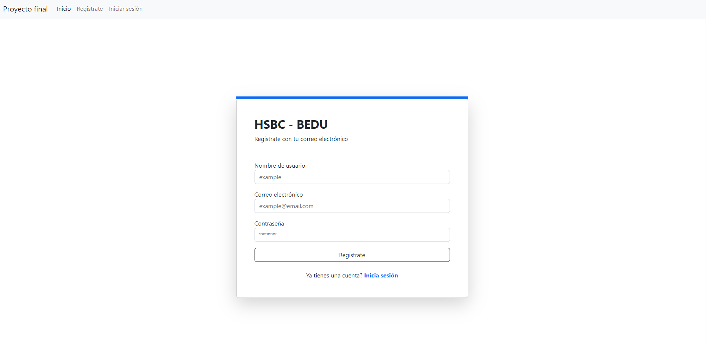
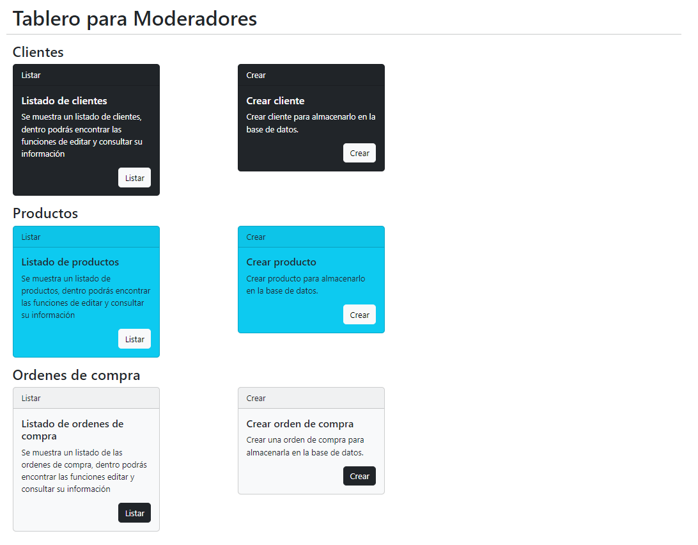
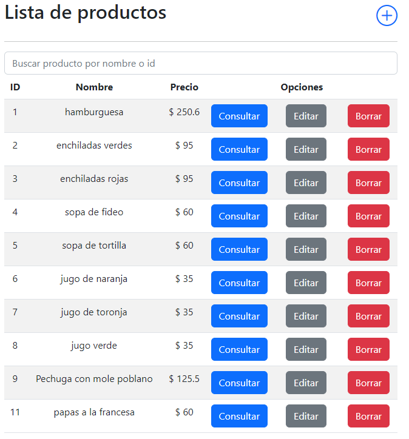

# **Proyecto final** :green_book:

## **Introducción** :gem:
En el siguiente proyecto creado a partir de los módulos impartidos por BEDU en colaboración con HSBC, se presenta una aplicación frontend desarrollada con Angular 15 y una backend API desarrollada con Spring Boot, que permite a los usuarios gestionar órdenes de compra, clientes y productos de manera eficiente y sencilla.

Este permite realizar operaciones CRUD (Crear, Leer, Actualizar y Eliminar) sobre entidades de clientes, productos y órdenes de compra. Además, permite realizar consultas sobre estas entidades y sus relaciones.

La aplicación es amigable y fácil de usar, ya que permite al usuario crear, editar y eliminar órdenes de compra, así como gestionar a los clientes y productos de manera rápida y sencilla.

Además, la aplicación utiliza una base de datos relacional para almacenar toda la información, lo que permite que los datos sean persistentes y estén disponibles en todo momento.

En resumen, este proyecto es una implementación de un API sencilla de gestión de órdenes de compra, clientes y productos, gracias a la utilización de Spring Boot y JPA.

## Entidades :books:
Las entidades del sistema son:

- `Customer`: representa a un cliente. Tiene un atributo `customer` que representa el nombre del cliente.
- `Product`: representa a un producto. Tiene atributos `name` y `price`, que representan el nombre y el precio del producto, respectivamente.
- `PurchaseOrder`: representa una orden de compra. Tiene un atributo `date` que representa la fecha de la orden de compra y una relación con la entidad `Customer` que representa al cliente que realiza la compra. Además, tiene una relación con la entidad `PurchaseOrderItem`, que representa los productos incluidos en la orden de compra.
- `PurchaseOrderItem`: representa un producto incluido en una orden de compra. Tiene una relación con la entidad `Product` que representa al producto y un atributo `quantity` que representa la cantidad del producto. Además, tiene una relación con la entidad `PurchaseOrder` que representa la orden de compra a la que pertenece.

## Mapeos :maple_leaf:

Se han creado mapeos entre las entidades y sus respectivos DTO (Data Transfer Object, objeto de transferencia de datos) para poder realizar operaciones de manera más sencilla y evitar problemas de seguridad. Los mapeos se encuentran en las interfaces `ICustomerMapper`, `IProductMapper`, `IPurchaseOrderMapper` y `IPurchaseOrderItemMapper`.

## Repositorios :loop:

Se han creado repositorios para cada entidad que permiten realizar operaciones CRUD sobre las mismas y realizar consultas. Los repositorios se encuentran en las interfaces `ICustomerRepository`, `IProductRepository`, `IPurchaseOrderRepository` y `IPurchaseOrderItemRepository`.

## Controladores :computer:

Se han creado controladores para cada entidad que permiten realizar operaciones CRUD y consultas sobre las mismas. Los controladores son `CustomerController`, `ProductController`, `PurchaseOrderController` y `PurchaseOrderItemController`.

## Servicios :recycle:

Se han creado servicios para cada entidad que realizan las operaciones necesarias sobre las entidades y sus relaciones. Los servicios son `CustomerService`, `ProductService`, `PurchaseOrderService` y `PurchaseOrderItemService`.

## LOGS :information_source:

Se ha implementado el uso de logs ya que puede ser muy útil para mejorar la calidad y el rendimiento del proyecto, y para facilitar la solución de problemas que puedan presentarse durante su ejecución.

## Excepciones personalizadas :anger:

Se han implementado excepciones personalizadas para indicar lo que sucede en diferentes casos de uso, se crearon las clases `DuplicateResourceException`, `InternalServerError`, `InvalidDataException`, `InvalidRequestException`, `NotFoundException`, `OperationNotAllowedException`, `ResourceNotFoundException`

## Conjunto de pruebas unitarias :boom:

Se ha creado un conjunto exhaustivo de pruebas unitarias suficientemente generales para verificar el funcionamiento de los componentes de la aplicación.

##  Proceso de autenticación y niveles de usuario :door:

La aplicación cuenta con un proceso de autenticación de usuarios para tener el conocimiento de quién hace cada una de las consultas, así como el nivel de cada usuario, dependiendo del usuario que haga la petición así como del nivel que este tenga, se le da acceso o se restringe el mismo a ciertas funcionalidades de la aplicación.

## Publicación de la aplicación :triangular_flag_on_post:

Se publicó la aplicación en los servicios de Amazon Web Services (AWS) así como la base de datos que utiliza, además está disponible para su uso dando click en: [Mi aplicación HSBC-BEDU](http://hsbcbedu-env.eba-jjfsw8ss.us-east-1.elasticbeanstalk.com), el usuario general es `admin` y el password es `admin`.

## **Requerimientos** :bookmark_tabs:

- `java 15`
- `Java(TM) SE Runtime Environment bu(ild 15)`
- `Maven`
- Base de datos `MySQL`
- Postman

## **Instrucciones** :clipboard:

1. Clonar el repositorio del siguiente <a href="https://github.com/88randy/BEDU" target="_blank">Enlace</a>.

    ```
    git clone https://github.com/88randy/BEDU

    ```

2. Ingresar a la carpeta del proyecto.

    ```
    cd Bedu/Java Backend II/Proyecto
    ```

3. Abrir el archivo `application.properties` con cualquier editor de texto.
   ```
    vim src/main/resources/application.properties
   ```

4. Configurar la conexión a la base de datos.
   (Dentro d el archivo se encuentran más propiedades pero solo hay que modificar las  siguientes tres).

   ```javascript
    spring.datasource.url=jdbc:mysql://localhost:{PUERTO}/{NOMBRE_BD}
    spring.datasource.username={USUARIO}
    spring.datasource.password={CONTRASENA}
   ```
   (Ejemplo de como quedaría el archivo)
   ```javascript
    spring.datasource.url=jdbc:mysql://localhost:3306/proyecto
    spring.datasource.username=root
    spring.datasource.password=123456789
   ```
   Una vez configurado el archivo con la información de la base de datos, guardamos cambios y cerramos.

## **Ejecución del proyecto** :sunglasses:

Para ejecutar el proyecto de manera local, podemo hacerlo desde la terminal con el comando.
```
cd proyecto-final-backend
mvn spring-boot:run
```

Abrir otra terminal e ingresar a la carpeta frontend
```
cd proyecto-finalfrontend
ng serve
```

Ya podemos utilizar la aplicación desde el navegador en `localhost:4200`

## **Registro e inicio de sesión**

Podemos crear una cuenta desde la aplicación dando click al botón `Registrate` o iniciar sesión en caso de que ya tengamos una cuenta dando click en el botón `Iniciar sesión`.

### Registro de usuario


### Inicio de sesión


## **Usuarios**

La aplicación cuenta con tres niveles de usuario:

- Usuario: permisos de solo lectura.
- Moderador: permisos de lectura, creación y actualización.
- Administrador: permisos completos, incluyendo creación actualización y eliminación.

podemos ingresar a la aplicación con cualquiera de los tres usuarios.

<table>
  <tr>
    <th>usuario</th>
    <th>contraseña</th>
    <th>roles</th>
  </tr>
  <tr>
    <td>admin</td>
    <td>123456789</td>
    <td>Administrador, Moderador, Usuario</td>
  </tr>
  <tr>
    <td>mod</td>
    <td>123456789</td>
    <td>Moderador, Usuario</td>
  </tr>
  <tr>
    <td>user</td>
    <td>123456789</td>
    <td>Usuario</td>
  </tr>
</table>

### Administrador


### Moderador


### Usuario 


## **Tableros**

Cada usuario de acuerdo al/los roles a los que pertenezca puede visualizar uno o más tableros.

### Tablero Administrador


### Tablero Moderador



### Tablero Usuario 


## **Operaciones CRUD**

De acuerdo con los permisos del rol al que pertenece el usuario podrá realizar operaciones CRUD de cada entidad, como había comentado antes:

La aplicación cuenta con tres niveles de usuario:

- Usuario: permisos de solo lectura.
- Moderador: permisos de lectura, creación y actualización.
- Administrador: permisos completos, incluyendo creación, actualización y eliminación.

## Clientes

Listado de clientes


Detalle del cliente


Agregar cliente


Editar cliente


Borrar cliente


## Producto

Listado de productos



Detalle del producto


Agregar producto


Editar producto


Borrar producto


## Orden de compra

Listado de ordenes de compra


Detalle orden de compra


Agregar orden de compra


Borrar orden de compra


## **Errores y excepciones**

En caso de errores o excepciones se manejaron de forma correcta y se visualizarán las siguientes pantallas en caso de error.

### **Error 401**

En caso de que se intente acceder a un recurso en el que no tenga permisos el usuario.


### **Error 404**

En caso de que el recurso que esté buscando no se encuentre en el servidor


### **Error 500**

En caso de que haya un error en el servidor o no pueda mostrar el recurso solicitado.


## **Mejoras** :blush:
En cuanto a mejoras que se le podrían hacer al proyecto, me gustaría:

- Continuar desarrollando la aplicación ya que se encuentra en un estado muy prematuro y podría agregar muchas funcionalidades más.
- Hacer la interfaz de usuario más amigable.


## **Conclusiones** :tada:
Fue un verdadero reto y un gusto haber participado en todo el curso y debo decir que aprendí bastante y no me queda más que agradecer a todas las personas que hicieron posible este curso y en especial a los expertos por su gran labor de compartir su conocimiento.

Sobre el proyecto podemos concluir que:

- Permite realizar operaciones CRUD y consultas sobre las entidades de clientes, productos y órdenes de compra dentro de cada uno de los controladores.
- Los controladores y servicios implementan las operaciones y consultas disponibles a través de la API REST.
- Cuenta con un conjunto exhaustivo de pruebas unitarias suficientemente generales para verificar el funcionamiento de los componentes de la aplicación.
- Se han creado mapeos y repositorios para facilitar el trabajo con las entidades y sus relaciones.
- La aplicación cuenta con un proceso de autenticación de usuarios para tener el conocimiento de quién hace cada una de las consultas, así como el nivel de cada usuario
- Se implementó el uso de logs para proporcionar información de monitoreo.
- Dependiendo del usuario que haga la petición así como del nivel que este tenga, se le da acceso o se restringe el mismo a ciertas funcionalidades de la aplicación
- La aplicación está publicada y disponible para su uso mediante AWS.
- La interfaz de usuario es amigable y cumple su función específica.


