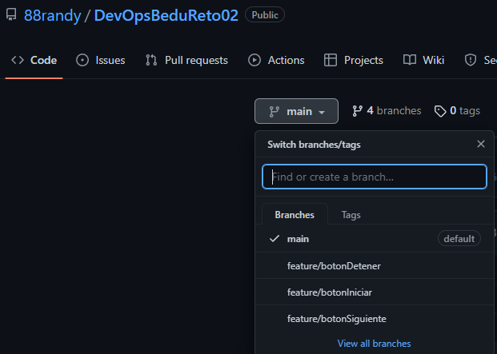
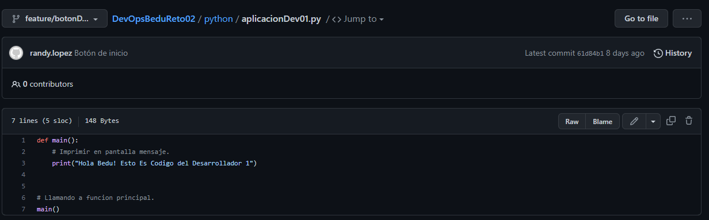
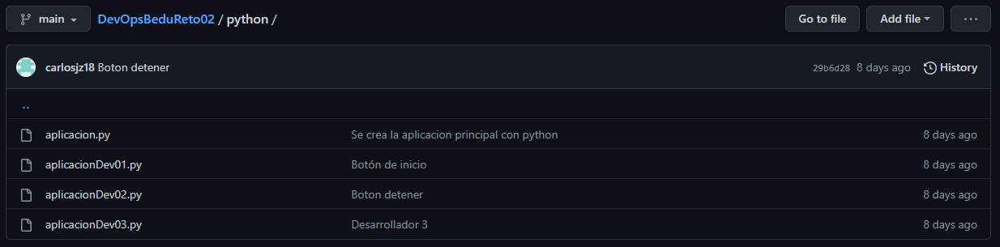
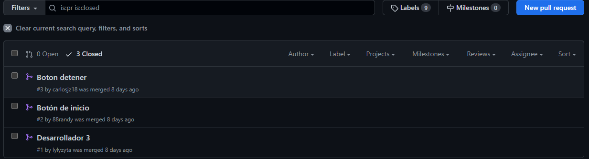

# Sesión 05: Flujos de DevSecOps y manejo de código

## 1. Crear un repositorio con distintos branches. 

El siguiente enlace es el repositorio creado para la actividad https://github.com/88randy/DevOpsBeduReto02

Creamos tres ramas aparte de la rama main


   
## 2. Modificación del código principal en distintos branches. 

En cada rama modificamos el código principal


   
## 3. Clonar un branch. 

Para clonar una rama nos posicionamos en el directorio del proyecto y ejecutamos lo siguiente:

```

# git clone -b <branchname> <remote-repo-url>

git clone -b feature/botonDetener https://github.com/88randy/DevOpsBeduReto02.git

```
   
## 4. Estructurar archivos y directorios, en Master/Main.

De esta manera estructuramos los archivos en la rama main


   
## 5. Subir archivos y directorios a Master/Main. 

Para subir archivos y directorios, hay que añadir los archivos, hacer un commit y luego un push para que se pueda hacer pull request con la rama main

```
# Agrega los archivos que se van a subir al repositorio
git add .

# Hace un commit y se agrega un mensaje
git commit -m "Nuevos cambios"

# Se suben los cambios en la rama seleccionada del repositorio
git push feature/botonDetener

```

Luego se puede hacer un pullrequest para agregar los cambios a la rama main



## 6. Crear un branch en GitHub.

Para crear una rama y cambiarnos a dicha rama basta con ejecutar lo siguiente:

```
# Crea una rama y nos cambia a esa rama
git checkout -b feature/botonIniciar

```