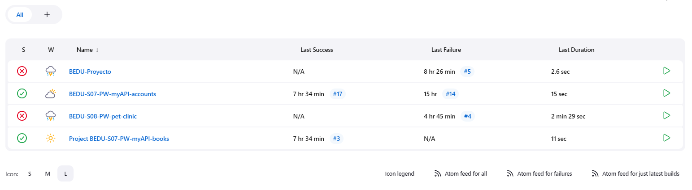

# Sesión 07: Jenkins como herramienta básica

## 1. Tener Jenkins instalado en local 

En el siguiente repositorio se ecnuentra el código para instalar jenkins desde docker

https://github.com/88randy/BEDU-S07-PW-myAPI-terraform

Ejecutamos

```
terraform fmt

terraform init

terraform plan

terraform apply
```

Una vez creado el contenedor con jenkins podemos ingresar a la ruta

http://127.0.0.1:8080

Donde nos solicitará una contraseña que podemos obtener desde el contenedro en el modo exec.

```
docker exec jenkins cat /var/jenkins_home/secrets/initialAdminPassword
```

Instalamos los siguientes plugins

- Pipeline
- Docker
- Docker Pipeline
- Environment Injector
- Git
- GitHub
- GitHub Authenticator

Ahora debemos asignar los permisos de docker.sock a jenkins, abrimos la consola y ejecutamos:

```
docker exec -it -u root jenkins /bin/bash

chown jenkins:jenkins /var/run/docker.sock
```

Verificamos

```
ls -lah /var/run/docker.sock

docker container list
```

Configuramos las variables de ambiente para MYSQL desde Jenkins.

- Vamos a Manage Jenkins y a Configure System.

- Seleccionamos Environment variables

Agregamos:

MYSQL_IP - 172.17.0.3

MYSQL_PASSWORD - abcD_1234

MYSQL_USER - root

## 2. Generar un pipeline para la construcción y el despliegue de nuestra aplicación 

En los siguientes repositorios se encuentra aplicaciones con su archivo Jenkinsfile para crear los pipelines

https://github.com/88randy/BEDU-S07-PW-myAPI-accounts

https://github.com/88randy/BEDU-S07-PW-myAPI-books



## 3. Configurar autenticación para el despliegue 
## 4. Agregar un disparador automático para la ejecución del pipeline